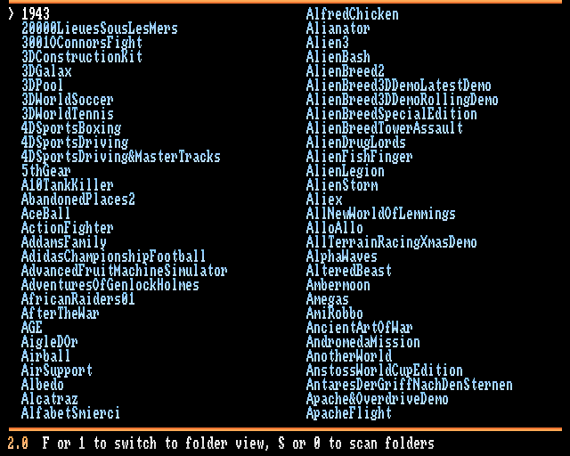
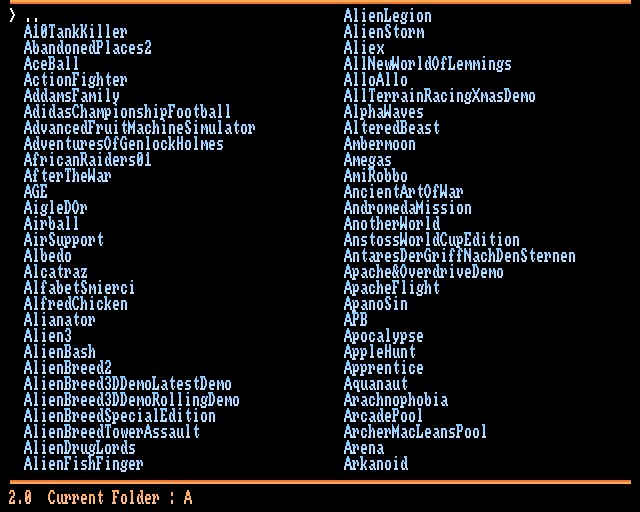

# JOST Launcher v2 for kickstart 1.3

Game/Demo launcher for JOST exe to run .slave for WHDLOAD compatible with 1.3 kickstart.

This is kind of a clone of [TinyLauncher](https://aminet.net/package/util/misc/TinyLauncher) from "Master" Gibs (french will understand this stupid joke).

Version 2 is a rewrite in C of the [Blitz Basic version](https://github.com/youenchene/JOST_Launcher) (0.x, now deprecated), with the same look and the same config file.

The target setup for this launcher is a CDTV with 8Mo fast memory and BlueCDTV/BlueSCSI SD Card hard disk. It also runs on a stock A500 with kickstart 1.3 and 512K chip + 512K slow memory.

You can fully control the launcher with your CDTV Remote, mouse mode or joy mode.



A folder mode is also available to see your games and demo by the parent folder:



## What's new in v2

Measured on an emulated A500 (kickstart 1.3, 512K chip + 512K slow, 420K free fast memory), with 250 games and the same Workbench 1.3 disk:

| | 0.3 (Blitz Basic) | 2.0 (C) | Gain |
|---|---|---|---|
| List on screen | 23.4 s | 10.8 s | **2.2× faster** |
| Fire → jst starts | ~10.7 s | ~1.9 s | **5.6× faster** |
| Memory left for the game | 222K | 407K | **+83%** |
| Back after a game | list broken | same list, same selection | — |
| Number of games | 255 max | no limit (tested with 3000) | — |

- While a game runs, only a small resident part of the launcher (13K) stays in memory: the menu is unloaded and reloaded after the game.
- jst is started directly, without a script or a shell.
- Inventory files from 0.x still work.

## How to install

Prequisites :
- Kickstart 1.3 (A500, CDTV...). Legit Kickstart files can be bought from [Amiga Forever](https://www.amigaforever.com/)
- You need `jst` in your `C:` folder. [Download](https://github.com/jotd666/jst)
- Your WHDLoad games installed in a folder, e.g. `Games:Games`, unpacked (jst can't read XPK packed files)

1. Download `jl.lha` from the [latest release](https://github.com/youenchene/JOST_Launcher_v2/releases/latest)
   (the loose files are there too).
2. Unpack it on your Amiga: `lha x jl.lha`
3. Copy the two executables to `C:`, both are needed:
   ```
   copy jl C:
   copy jl-menu C:
   ```
4. Set `scan_dir_1` in `jl-config.cfg` to your games folder (see below), and copy it to `S:`:
   ```
   copy jl-config.cfg S:
   ```
5. Run `jl`, press S (or 0 on the remote) then Enter to scan. The list is saved in
   `S:jl-inventory.data`, so the next starts don't need a scan.

Launch it through CLI or add `jl` at the end of your `S:startup-sequence`.

**Upgrading from 0.x:** replace `C:jl` with the new one and add `C:jl-menu`. Your
`S:jl-config.cfg` and `S:jl-inventory.data` still work.

## How to control

CDTV Remote (mouse mode or joy mode) :
- Arrow to navigate
- A or B button To launch
- 0 to scan your whdload games or demo folder.
- 1 to switch to folder mode
- B button to cancel a scan

Any joystick/joypad :
- Arrow to navigate
- Fire button To launch

Keyboard :
- Arrow to navigate
- Enter (or keypad Enter) To launch
- S to scan your whdload games or demo folder, C to cancel the scan
- F to switch to folder mode
- Escape to quit

## jl-config.cfg setup

### scan_dir_1

**Mandatory**

To specify the folder to be scanned. No trailing `/` at the end please.

Example:

`scan_dir_1=Games:Games`

### scan_dir_2 to scan_dir_4

_Optional_

More folders to scan.

Example:

`scan_dir_2=Demos:Demos`

### inventory_file

_Optional_

To specify an inventory file other than the default one (`S:jl-inventory.data`)

Example:

`inventory_file=Games:inventory_1.data`

### folder_mode_by_default

_Optional_

To define default behaviour after startup (folder mode or list mode).

`folder_mode_by_default=true`

### jst_command

_Optional_

The command used to start a slave, `jst` by default (looked up in `C:`).

`jst_command=jst`

## Build and test

Cross-compiled in Docker and tested headless on an emulated A500/CDTV with the [Amiga Game Kit](https://github.com/codebase/amiga-game-kit):

```sh
cp tools/env.example tools/env.local   # then set your own Workbench 1.3 ADF, WHDLoad games, jst, ROMs
tools/check                            # unit tests, build, test disk, emulator tests
```

See [AGENTS.md](AGENTS.md) for the layout, the tools and the kickstart 1.3 pitfalls.

## Dev Documentation

- http://amigadev.elowar.com/read/ADCD_2.1/Includes_and_Autodocs_3._guide/node015E.html
- https://github.com/jotd666/jst

## Credits

 - Jotd/Jean-François Fabre for his huge work on jst.
 - Daedalus and Earok from the blitzbasic.dev discord.
 - Whdload contributors.
 - Gibs for his work on TinyLauncher.

## Release Notes

### 2.0
 - refactor: rewrite in C (was Blitz Basic 2), same look
 - fix: list broken and memory lost after launching a game (0.x started a new copy of itself after each game)
 - fix: games missing or out of order in the list above 255 games
 - fix: long slave file names cut at 30 characters
 - perf: jst is started directly, without a script or a shell
 - perf: the menu is unloaded while a game runs (13K stays resident)
 - perf: the inventory is saved in name order, next starts skip the sort
 - feat: selection kept when coming back from a game
 - feat: up to 4 scan folders (`scan_dir_2` to `scan_dir_4`)
 - feat: new optional config entry `jst_command`
 - feat: "Could not start" message when a game can't be launched

Older versions: see the [0.x project](https://github.com/youenchene/JOST_Launcher#release-notes).

## Release

`tools/release` builds `build/release/jl.lha` (unit tests, cross-compile in Docker,
strip, pack). It doesn't need the Amiga Game Kit. The [release workflow](.github/workflows/release.yml)
runs it on every push, and publishes a GitHub release when a version tag is pushed:

1. Update the version in `src/app.h` (`JL_VERSION`), `src/stub/stub.c` (`$VER`) and
   `dist/jl.readme` (`Version:` and a `## X.Y` release notes section).
2. `git tag v2.1 && git push origin v2.1`
